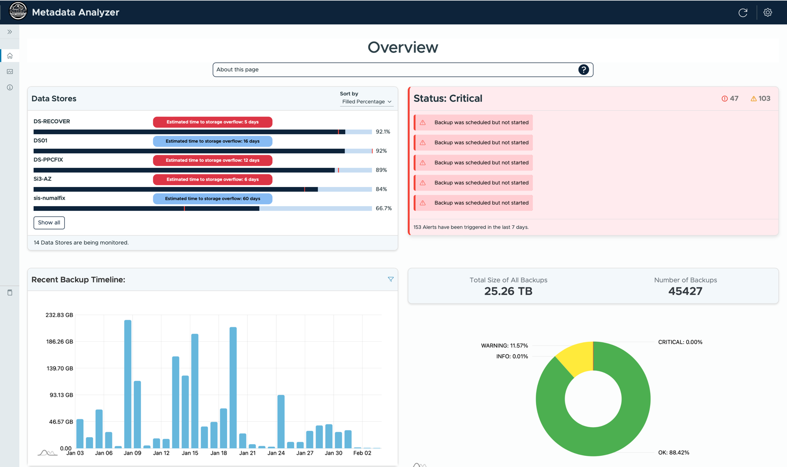

TODO: Fix image scaling/cropping (when adding the css manually via the browser tools, it works. But not when the style is in the README directly)
<div align="center">
    
    <h1>Backup Metadata Analyzer</h1>
</div>



## Product Vision
Databackups are an essential functionality for businesses. They ensure, that no important information or artifacts of work is lost due to technical errors or hacking. This metadata analyzer aims to help detect problems or anomalies with backups. This problem detection is done in a timely manor, and in some cases even predictively, to help the customer to react before major damages occur.

## Product Mission
This project aims to explore which data analysis methods are applicable to the backup metadata, which is generated by the industry partner´s backup software "SESAM". Furthermore, the results of the analysis are condensed into insights and displayed with graphs and alerts. This will help the customer to better understand their backup data and focus on the important take aways.

## Project Structure


The project is structured in three modules:
- Frontend
- Backend
- Analyzer

TODO: expand this section
### Frontend
The frontend uses Angular, ...

### Backend
The backend uses NestJS, ...


### Analyzer
The analyzer is implemented in python and uses flask to provide REST APIs for updating backend data and triggering or configuring different analysis modes.


TODO: maybe add a section about contributing: protected dev branch, automatic tests using github actions

TODO: 🚀 maybe add cool emojis before every heading 😎

## Prerequisites
Make sure the following are installed on your machine:

- **Node 20**
- **Docker**
- **Docker Compose**

## Building with Docker
1. **Clone the repository**:

   ```bash
   git clone https://github.com/amosproj/amos2024ws02-backup-metadata-analyzer.git

   ```

2. **Change directory**:

   ```bash
    cd ./amos2024ws02-backup-metadata-analyzer/

   ```

3. **Setup .env files**:

   In the projects root folder, copy the **.env.docker.example** and rename the copy to **.env.docker**

4. **Copy database dump into project**:

   Copy the database dump .dmp file into the projects root folder and rename it to **db_dump.sql**

5. **Build  Docker container**:

   ```bash
    docker compose --env-file .env.docker build --no-cache

   ```

6. **Start Docker container**:

   ```bash
    docker compose --env-file .env.docker up

   ```

7. **Stop Docker Container**:
   ```bash
    docker compose --env-file .env.docker down
   ```
